# 🧠 Brain Tumor MRI Classification Using Ensemble CNN, XAI, and Hardware-Accelerated Edge Deployment

[](https://www.python.org/)
[](https://www.tensorflow.org/)
[](https://www.xilinx.com/)
[](LICENSE)
[](https://www.lnmiit.ac.in/)

> **B.Tech Mini Project** | Department of Electronics and Communication Engineering  
> The LNM Institute of Information Technology, Jaipur  
> **Author:** Tanmay Rawal (Roll No: 23DEC511) | **Supervisor:** Dr. Kusum Lata

---

## 📋 Table of Contents

- [Overview](#-overview)
- [Project Architecture](#-project-architecture)
- [Dataset](#-dataset)
- [Preprocessing Pipeline](#-preprocessing-pipeline)
- [Deep Learning Models](#-deep-learning-models)
- [Ensemble Strategy](#-ensemble-strategy)
- [Explainability (XAI)](#-explainability-xai)
- [Results](#-results)
  - [Classification Performance](#classification-performance)
  - [Confusion Matrices](#confusion-matrices)
  - [Training Curves](#training-curves)
  - [XAI Visualizations](#xai-visualizations)
- [Hardware Deployment (PYNQ-ZU FPGA)](#-hardware-deployment-pynq-zu-fpga)
- [Repository Structure](#-repository-structure)
- [Installation & Setup](#-installation--setup)
- [How to Run](#-how-to-run)
- [Requirements](#-requirements)

---

## 🔍 Overview

This project presents a **complete end-to-end brain tumor detection system** that spans software training, model interpretability, hardware optimization, and real-time FPGA deployment.

Three state-of-the-art CNN architectures — **EfficientNetB0**, **InceptionV3**, and **Xception** — are trained with transfer learning on a Brain Tumor MRI dataset. Their predictions are fused into a **Weighted Ensemble** model. Model decisions are made transparent using **Grad-CAM**, **LIME**, and **SHAP** explainability techniques, with quantitative XAI evaluation via fidelity, consistency, and stability scores. The InceptionV3 model is subsequently **quantized to INT8** using the Xilinx Vitis AI toolchain and **deployed on a PYNQ-ZU FPGA** for real-time, low-power edge inference.

---

## 🏗️ Project Architecture

```
MRI Input
    │
    ▼
┌─────────────────────────────┐
│     Preprocessing Pipeline   │
│  Crop → Denoise → Colormap  │
│       → Resize (224×224)     │
└────────────┬────────────────┘
             │
    ┌────────┴────────┐
    │   Data Split     │
    │  80% / 10% / 10% │
    └────────┬─────────┘
             │
    ┌────────┴──────────────────────────┐
    │          CNN Training              │
    │  EfficientNetB0 | InceptionV3     │
    │         | Xception                │
    │  (Transfer Learning + Fine-tuning) │
    └────────┬──────────────────────────┘
             │
    ┌────────┴────────────┐
    │   Weighted Ensemble  │
    │  (val-accuracy based │
    │      weighting)      │
    └────────┬────────────┘
             │
    ┌────────┴────────────────────────────┐
    │         XAI Explainability           │
    │  Grad-CAM | LIME | SHAP             │
    │  Metrics: Fidelity, Consistency,    │
    │           Stability                 │
    └────────┬────────────────────────────┘
             │
    ┌────────┴───────────────────────┐
    │    FPGA Hardware Deployment     │
    │  Vitis AI → INT8 Quantization  │
    │     → PYNQ-ZU DPU Inference    │
    └────────────────────────────────┘
```

---

## 📊 Dataset

**Source:** [Kaggle — Brain Tumor MRI Dataset](https://www.kaggle.com/datasets/masoudnickparvar/brain-tumor-mri-dataset)
---

## 🧾 Dataset Overview

Below is a visual overview of the four MRI categories used in this project:

- **No Tumor**
- **Glioma**
- **Meningioma**
- **Pituitary Tumor**

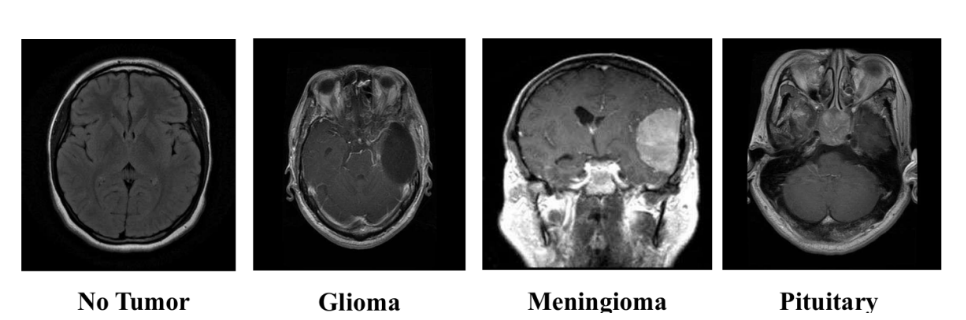

> The dataset contains diverse MRI orientations and tumor shapes, making it suitable for evaluating generalization capability of deep CNN models.
The dataset contains **7,023 MRI scans** drawn from Figshare, SARTAJ, and Br35H datasets, classified into four categories:

| Class | Training Images | Testing Images |
|-------|----------------|----------------|
| Glioma | 1,321 | 300 |
| Meningioma | 1,339 | 306 |
| No Tumor | 1,595 | 405 |
| Pituitary | 1,457 | 300 |
| **Total** | **5,712** | **1,311** |

> **Note:** Do not upload the dataset to the repository. Download it directly from Kaggle and place `archive.zip` in the project root. The notebooks extract it automatically.

---

## 🔧 Preprocessing Pipeline

### ✂️ Illustration of Cropping Process

The cropping stage isolates the brain region using contour detection and removes irrelevant background structures.

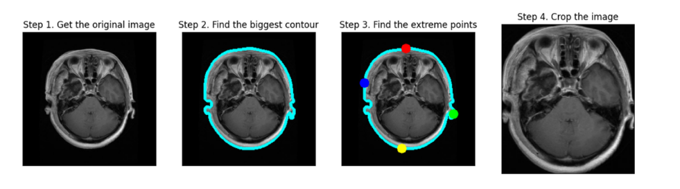

> The cropping mechanism ensures that the model focuses only on relevant anatomical regions, improving both training stability and interpretability.
Each raw MRI scan passes through four sequential stages before being fed into any model:

**1. Cropping (ROI Extraction)** — OpenCV contour detection isolates the brain region. Gaussian blur + Otsu thresholding creates a binary mask, the largest contour defines the brain boundary, and extreme points mark crop edges. Background (hair, skin) is removed.

**2. Noise Removal** — A bilateral filter (`d=2, sigmaColor=50, sigmaSpace=50`) smooths the image while preserving tumor boundary edges.

**3. Colormap Application** — `cv2.COLORMAP_BONE` enhances contrast between tissue types, improving visual separation between tumor and non-tumor regions.

**4. Resize** — All images are standardized to **224 × 224 pixels**.


### 🧠 Preprocessed Image Grid

Below is a sample grid of preprocessed MRI images after cropping, denoising, colormap application, and resizing:

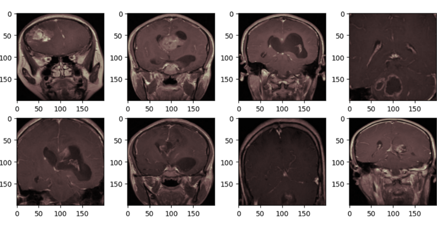

> The preprocessing pipeline standardizes contrast and spatial resolution across all samples before feeding them into the CNN models.
### Data Split (80–10–10)
- **Training:** 5,712 images (full original training set)
- **Validation:** 656 images (50% of original testing folder)
- **Testing:** 655 images (remaining 50% of original testing folder)

### Data Augmentation
Real-time augmentation via Keras `ImageDataGenerator`:
```python
ImageDataGenerator(
    rotation_range=10,
    width_shift_range=0.05,
    height_shift_range=0.05,
    horizontal_flip=True
)
```

---

## 🤖 Deep Learning Models

All three models share the same training configuration and custom classification head.

### Common Hyperparameters

| Parameter | Value |
|-----------|-------|
| Learning Rate | 1 × 10⁻⁴ |
| Optimizer | Adam |
| Batch Size | 32 |
| Epochs | 25 |
| Dropout | 0.4 |
| Loss Function | Categorical Cross-Entropy |
| Final Activation | Softmax |

### Custom Classification Head (shared by all models)
```
GlobalAveragePooling2D
→ Dense(250, relu) → Dropout(0.4)
→ Dense(100, relu) → Dropout(0.4)
→ Dense(25, relu)
→ Dense(4, softmax)
```

### Model Comparison

| Model | Parameters | Last Layers Unfrozen | Preprocessing |
|-------|-----------|---------------------|---------------|
| **EfficientNetB0** | ~5.3M | Last 30 | `efficientnet.preprocess_input` |
| **InceptionV3** | ~21.8M | Last 30 | `xception.preprocess_input` |
| **Xception** | ~21M | Last 30 | `xception.preprocess_input` |

All models use **ImageNet pre-trained weights** for transfer learning.

---

## 🔗 Ensemble Strategy

The **Weighted Ensemble** combines predictions from all three base models using accuracy-proportional weights derived from validation performance:

```python
# Weights computed from validation accuracies
total_accuracy = val_acc_effnet + val_acc_inception + val_acc_xception
weights = [val_acc_effnet/total, val_acc_inception/total, val_acc_xception/total]

# Final ensemble prediction
ensemble_probs = (weights[0] * preds_effnet +
                  weights[1] * preds_inception +
                  weights[2] * preds_xception)
final_pred = argmax(ensemble_probs)
```

---

## 🔬 Explainability (XAI)

Three complementary explainability techniques are applied, along with quantitative evaluation metrics.

**Grad-CAM** — Backpropagates gradients from the target class to the final convolutional layer to generate heatmaps showing which MRI regions most influence the model's decision.

**LIME** — Segments the input image into super-pixels and perturbs them to identify which regions most strongly affect the predicted probability — sparse, human-interpretable local explanations.

**SHAP** — Uses a game-theoretic framework (Shapley values) to attribute each pixel's contribution, providing both positive and negative feature attribution maps.

### XAI Evaluation Metrics

| Metric | Description |
|--------|-------------|
| **Fidelity** | How accurately the explanation reflects the model's true behavior |
| **Consistency** | Reproducibility of explanations across similar inputs |
| **Stability** | Robustness of explanations to small input perturbations |


## 📊 Quantitative XAI Evaluation Results

To objectively compare explanation methods, we computed three evaluation metrics:

- **Fidelity**
- **Consistency**
- **Stability**

| Method   | Consistency | Fidelity  | Stability |
|----------|------------|-----------|-----------|
| Grad-CAM | 0.238718   | 0.466436  | 0.727833  |
| LIME     | 0.312174   | 0.655439  | 0.428957  |
| SHAP     | 0.342654   | 0.543291  | 0.624260  |

### Interpretation

- **LIME** achieves the highest fidelity.
- **SHAP** demonstrates the best consistency.
- **Grad-CAM** shows strongest stability.

This quantitative evaluation provides a scientific comparison of explanation reliability rather than relying only on visual interpretation.

## 📈 Results

### Overall Classification Performance

| Model | Accuracy | Macro F1 | Weighted F1 | Avg. Inference (ms) |
|-------|----------|----------|-------------|---------------------|
| EfficientNetB0 | 98.48% | 0.9835 | 0.9847 | 53.1 |
| InceptionV3 | 98.93% | 0.9884 | 0.9893 | 64.0 |
| Xception | 99.09% | 0.9901 | 0.9908 | 115.0 |
| **Weighted Ensemble** | **99.39%** | **0.9933** | **0.9939** | 345.6 |

---

### 1️⃣ EfficientNetB0 — Test Accuracy: 98.48% | Avg. Inference: 53.1 ms

**Per-Class Metrics:**

| Class | Precision | Recall | F1-Score |
|-------|-----------|--------|----------|
| Glioma | 1.0000 | 0.9467 | 0.9726 |
| Meningioma | 0.9497 | 0.9869 | 0.9679 |
| No Tumor | 1.0000 | 1.0000 | 1.0000 |
| Pituitary | 0.9868 | 1.0000 | 0.9934 |
| **Weighted Avg** | **0.9853** | **0.9848** | **0.9847** |

**Confusion Matrix:**

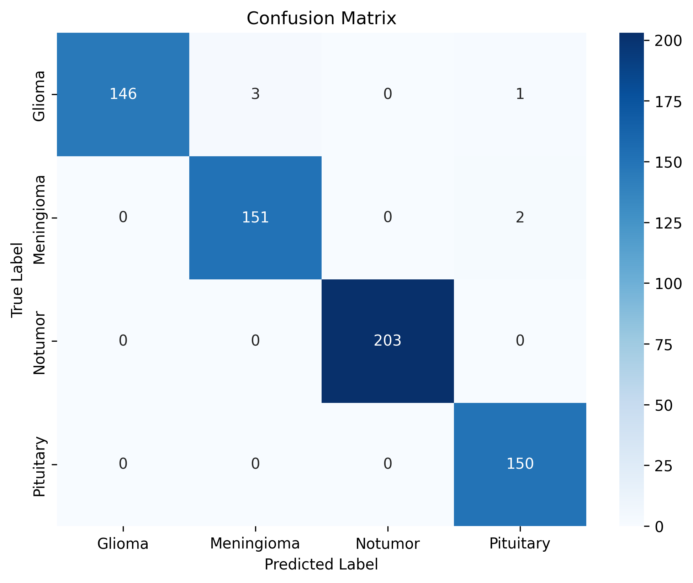

**Training vs Validation Accuracy:**

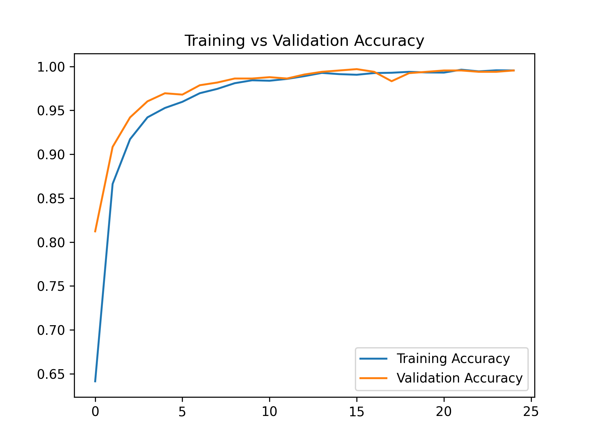

**Training vs Validation Loss:**

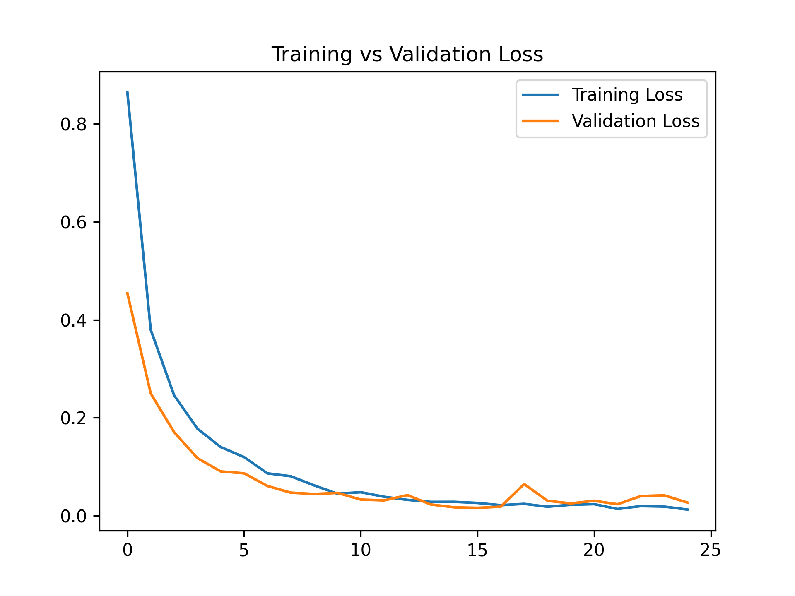

> EfficientNetB0 achieves strong results with the fastest inference time (53.1 ms) due to its compact ~5.3M parameter architecture. Training and validation curves converge smoothly with no significant overfitting. The main misclassifications are 3 Glioma samples predicted as Meningioma and 2 Meningioma as Pituitary, which are visually similar classes.

---

### 2️⃣ InceptionV3 — Test Accuracy: 98.93% | Avg. Inference: 64.0 ms

**Per-Class Metrics:**

| Class | Precision | Recall | F1-Score |
|-------|-----------|--------|----------|
| Glioma | 0.9932 | 0.9667 | 0.9797 |
| Meningioma | 0.9742 | 0.9869 | 0.9805 |
| No Tumor | 1.0000 | 1.0000 | 1.0000 |
| Pituitary | 0.9868 | 1.0000 | 0.9934 |
| **Weighted Avg** | **0.9894** | **0.9893** | **0.9893** |

**Confusion Matrix:**


**Training vs Validation Accuracy:**

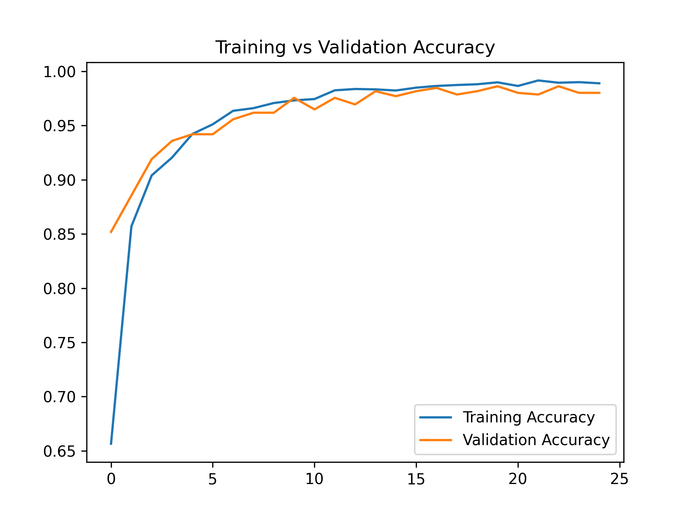

**Training vs Validation Loss:**

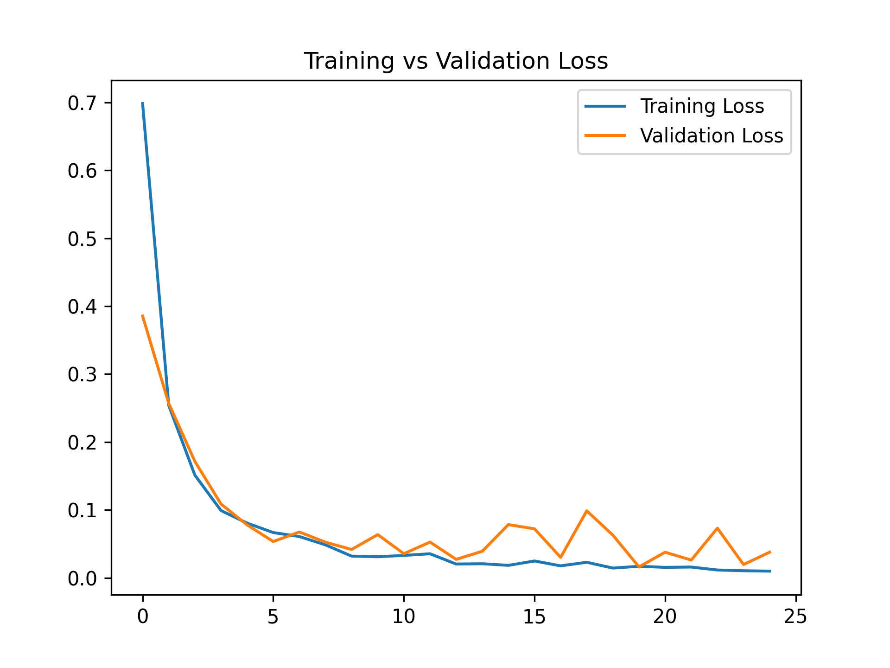

> InceptionV3 converges quickly within the first 5 epochs and stabilizes near 99% validation accuracy by epoch 25. Training and validation curves track closely with no overfitting. Its 42-layer architecture provides improved feature extraction over EfficientNetB0 at a modest latency cost of 64 ms.

---

### 3️⃣ Xception — Test Accuracy: 99.09% | Avg. Inference: 115.0 ms

**Per-Class Metrics:**

| Class | Precision | Recall | F1-Score |
|-------|-----------|--------|----------|
| Glioma | 1.0000 | 0.9733 | 0.9865 |
| Meningioma | 0.9805 | 0.9869 | 0.9837 |
| No Tumor | 1.0000 | 1.0000 | 1.0000 |
| Pituitary | 0.9804 | 1.0000 | 0.9901 |
| **Weighted Avg** | **0.9910** | **0.9909** | **0.9908** |

**Confusion Matrix:**


**Training vs Validation Accuracy:**

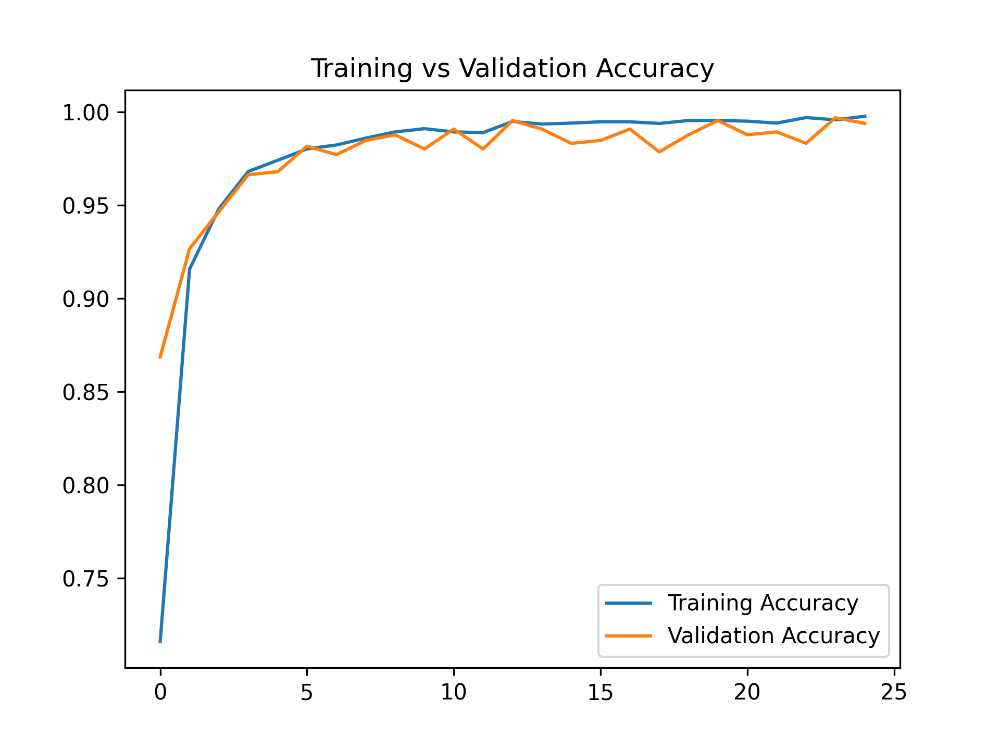

**Training vs Validation Loss:**


> Xception is the best-performing individual model (99.09%) achieving perfect No Tumor and Pituitary classification. Its 71-layer depthwise separable convolution architecture provides the strongest generalization at a higher inference cost of 115 ms.

---

### 4️⃣ Weighted Ensemble — Test Accuracy: 99.39% | Avg. Inference: 345.6 ms

**Per-Class Metrics:**

| Class | Precision | Recall | F1-Score |
|-------|-----------|--------|----------|
| Glioma | 1.0000 | 0.9800 | 0.9899 |
| Meningioma | 0.9870 | 0.9935 | 0.9902 |
| No Tumor | 1.0000 | 1.0000 | 1.0000 |
| Pituitary | 0.9868 | 1.0000 | 0.9934 |
| **Weighted Avg** | **0.9940** | **0.9939** | **0.9939** |

**Confusion Matrix:**

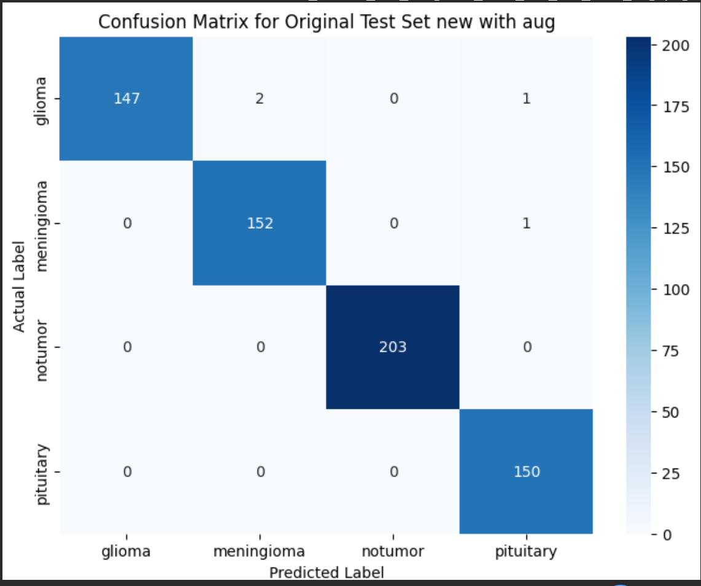

> The Weighted Ensemble achieves the highest overall accuracy (99.39%) by combining all three models using validation-accuracy-proportional weights. The ensemble is ideal for offline or diagnostic-priority settings where maximum precision matters more than inference speed.

---

### XAI Visualizations

#### Grad-CAM — Class Activation Heatmaps
Grad-CAM highlights the regions that most strongly influence the model's prediction by backpropagating gradients to the final convolutional layer. Red/yellow areas indicate high activation. The activated regions correspond closely to the actual tumor locations, confirming the model relies on clinically relevant anatomy.

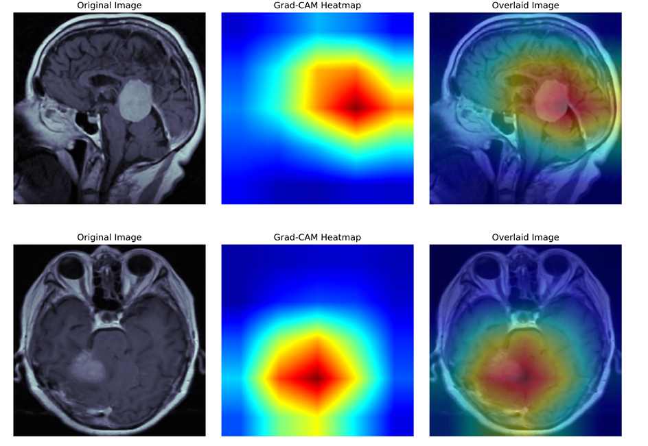

#### LIME — Local Super-pixel Explanations
LIME segments the MRI into super-pixels and identifies which regions most strongly affect the predicted probability when perturbed. Green highlighted regions are the most influential super-pixels — Glioma (left pair) and Meningioma (right pair).

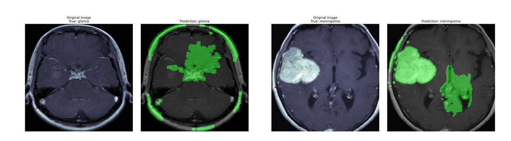

#### SHAP — Shapley Value Attribution Maps
SHAP assigns a contribution value to every pixel using game-theoretic Shapley values. Red pixels push the prediction toward the predicted class; blue pixels push against it. The maps provide fine-grained pixel-level insight into how different MRI regions jointly drive the model's decision.

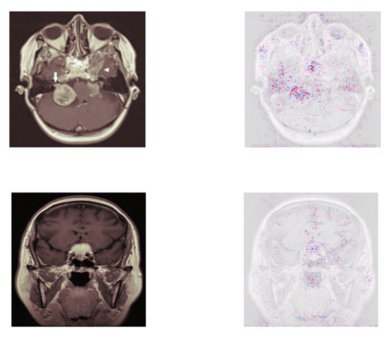

---

## ⚡ Hardware Deployment (PYNQ-ZU FPGA)

The InceptionV3 model is deployed on the **PYNQ-ZU** (Xilinx Zynq UltraScale+ MPSoC) using the Vitis AI toolchain.

### Deployment Pipeline

```
Trained Keras Model (FP32)
        │
        ▼
  Vitis AI Docker (WSL2)
        │
        ├── Post-Training Quantization (FP32 → INT8)
        │       python quantize_tf2.py
        │
        ├── DPU Compilation (DPUCZDX8G / ZCU104 arch)
        │       vai_c_tensorflow2 → tumor_net_tf2.xmodel
        │
        └── Deploy to PYNQ-ZU
                │
                ├── DpuOverlay("dpu.bit")
                ├── load_model("tumor_net_tf2.xmodel")
                └── On-board inference via VART runner
```

### Quantization Results

| Representation | Accuracy |
|----------------|----------|
| Float32 (FP32) | 99.79% |
| INT8 (Quantized) | 98.76% |
| **Accuracy Drop** | **−1.03 pp** |

### On-Board Inference Pipeline

1. **PS (ARM Cortex-A53):** Load image → Resize to 224×224 → Inception-style normalization (`[0,255] → [-1,1]`) → INT8 quantization
2. **PL (DPU Core — DPUCZDX8G):** Execute all CNN layers in hardware
3. **PS (post-processing):** Argmax on INT8 logits → predicted class label

### On-Board Validation Results (20 images, 5 per class)

| Class | Correct | Accuracy |
|-------|---------|----------|
| Glioma | 3/5 | 60% |
| Meningioma | 3/5 | 60% |
| No Tumor | 4/5 | 80% |
| Pituitary | 5/5 | 100% |
| **Overall** | **15/20** | **75%** |

> The reduced accuracy on this 20-image subset reflects the very small sample size. The INT8 model on the full validation set achieves 98.76%, confirming the DPU deployment maintains near-FP32 performance at the edge.

---

## 📁 Repository Structure

```
Brain-Tumor-MRI-Classification-Using-Ensemble-CNN-XAI-and-Hardware-Accelerated-Edge-Deployment/
│
├── Readme.md
│
├── notebooks/
│   ├── 01_EfficientNetB0.ipynb
│   ├── 02_InceptionV3.ipynb
│   ├── 03_Xception.ipynb
│   └── 04_Ensemble.ipynb
│
├── hardware/
│   ├── Dpu_inference.ipynb
│   ├── wifi_connectivity.ipynb
│   ├── tumor_net_tf2.xmodel
│   └── HARDWARE_README.md
│
├── results/
│   ├── confusion_matrix/
│   │   ├── efficientnetb0.png
│   │   ├── inceptionv3.png
│   │   ├── xception.png
│   │   └── ensemble.png
│   │
│   ├── training_curves/
│   │   ├── efficientnetb0_accuracy.png
│   │   ├── efficientnetb0_loss.png
│   │   ├── inceptionv3_accuracy.png
│   │   ├── inceptionv3_loss.png
│   │   ├── xception_accuracy.png
│   │   └── xception_loss.png
│   │
│   └── XAI/
│       ├── gradcam.png
│       ├── lime.png
│       ├── shap.png
│       ├── cropping_process.png
│       ├── dataset_overview.png
│       └── preprocessed_grid.png
│
└── dataset/
    

---

## ⚙️ Installation & Setup

### 1. Clone the Repository
```bash
git clone https://github.com/TanmayRawal/Brain-Tumor-MRI-Classification-Using-Ensemble-CNN-XAI-and-Hardware-Accelerated-Edge-Deployment.git
cd Brain-Tumor-MRI-Classification-Using-Ensemble-CNN-XAI-and-Hardware-Accelerated-Edge-Deployment
```

### 2. Install Dependencies
```bash
pip install -r requirements.txt
```

### 3. Download the Dataset
Download from [Kaggle](https://www.kaggle.com/datasets/masoudnickparvar/brain-tumor-mri-dataset) and place `archive.zip` in the project root. The notebooks extract it automatically.

---

## 🚀 How to Run

Run notebooks in order — each saves `.h5` weights that the ensemble notebook loads:

```bash
# Step 1: EfficientNetB0 → saves "25 epochs efficentnet aug.h5"
jupyter notebook notebooks/01_EfficientNetB0.ipynb

# Step 2: InceptionV3 → saves "25_epochs_weights_new_inception.h5"
jupyter notebook notebooks/02_InceptionV3.ipynb

# Step 3: Xception → saves "25_epochs_weights_xception.h5"
jupyter notebook notebooks/03_Xception.ipynb

# Step 4: Weighted Ensemble (loads all 3 saved weights)
jupyter notebook notebooks/04_Ensemble.ipynb

```

For PYNQ-ZU hardware deployment, see [`hardware/HARDWARE_README.md`](hardware/HARDWARE_README.md).
---

## 📦 Requirements

```
tensorflow>=2.10.0
numpy
opencv-python
scikit-learn
matplotlib
seaborn
pandas
lime
shap
h5py
Pillow
jupyter
```

> **GPU recommended** for training. All experiments were conducted in a GPU-enabled Jupyter environment.

---

## 📖 Citation

```
Rawal, T. (2025). Design, FPGA Implementation and Analysis of a CNN-Based Tumor Detection System.
B.Tech Mini Project Report, Department of ECE, LNMIIT Jaipur.
Supervisor: Dr. Kusum Lata.
```

---

## 🙏 Acknowledgments

- **Dr. Kusum Lata** (Project Supervisor, LNMIIT Jaipur) for guidance and support
- **Prashant Singh** (PhD Scholar, LNMIIT) for hardware guidance and introducing the FPGA platform
- [Kaggle Brain Tumor MRI Dataset](https://www.kaggle.com/datasets/masoudnickparvar/brain-tumor-mri-dataset) contributors
