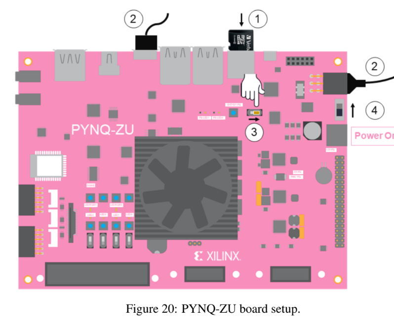
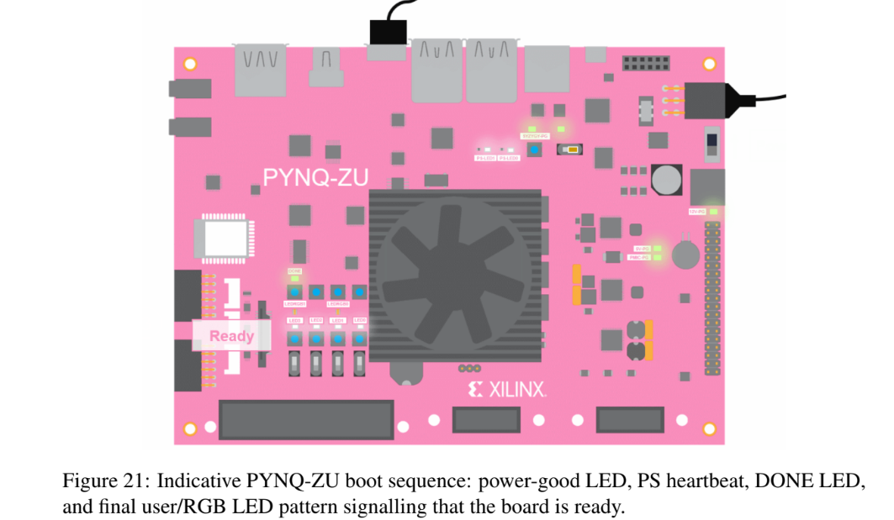
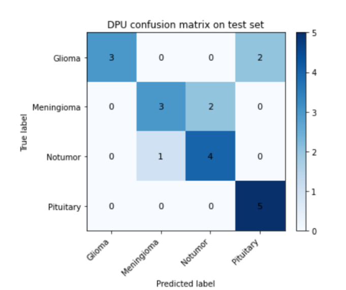
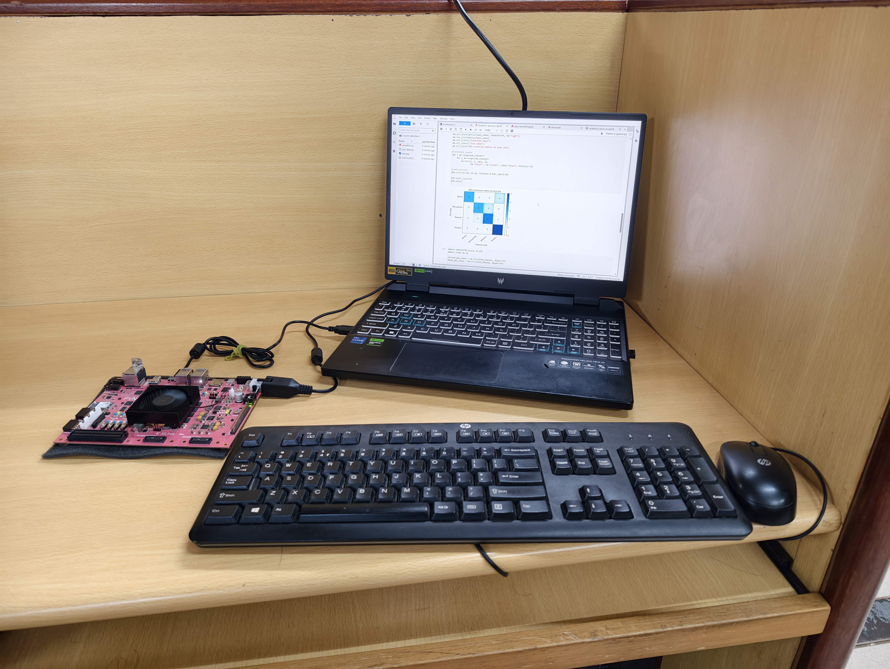

# ⚡ FPGA Deployment – Brain Tumor Detection on PYNQ-ZU

> INT8 Quantized InceptionV3 | Vitis AI 2.5.1 | DPUCZDX8G | Edge Inference

---

# 📌 Overview

This folder documents the complete hardware implementation of the CNN-based Brain Tumor MRI classifier on the **PYNQ-ZU FPGA platform**.

Deployment pipeline includes:

- TensorFlow model export
- INT8 post-training quantization
- DPU compilation
- `.xmodel` generation
- On-board inference using PYNQ-DPU
- Hardware validation

---

# 🏗️ PYNQ-ZU Board Setup

The PYNQ-ZU board is powered using a 12V adapter and booted via SD card.
The Micro-USB cable connects the board to a host PC for Jupyter access.

### 📷 Board Setup Diagram



---

# 🔄 Boot Sequence Indicators

During boot, the following LED sequence confirms successful initialization:

1. 12V-PG LED → Power stable  
2. PS-LED0 → Linux heartbeat blinking  
3. DONE LED → FPGA configured  
4. User/RGB LEDs → Final ready state  

### 📷 Boot Sequence LEDs



---

# 🐳 Vitis AI Deployment Flow (Host Side)

Deployment preparation performed using:

- Windows + WSL2
- Docker Desktop
- Vitis AI Docker (TensorFlow2)

## Step 1 – Launch Docker

```bash
docker pull xilinx/vitis-ai
bash docker_run.sh xilinx/vitis-ai
```

## Step 2 – Activate TF2 Environment

```bash
conda activate vitis-ai-tensorflow2
```

---

# ⚙️ INT8 Quantization

```bash
python quantize_tf2.py --model saved_model_keras --calib_dir calib_images --output_dir quantized_model --input_size 224 --batch 32 --steps 100
```

---

# 🧩 DPU Compilation

```bash
vai_c_tensorflow2 --model quantized_model/deploy_model --arch arch.json --output_dir build --net_name tumor_net_tf2
```

Generated file:

```
tumor_net_tf2.xmodel
```

---

# 📊 FP32 vs INT8 Accuracy

| Model | Accuracy |
|--------|----------|
| FP32 | 99.79% |
| INT8 | 98.76% |
| Accuracy Drop | 1.03% |

---

# 🚀 On-Board Deployment

```python
from pynq_dpu import DpuOverlay

overlay = DpuOverlay("dpu.bit")
overlay.load_model("tumor_net_tf2.xmodel")
dpu = overlay.runner
```

---

# 🧠 On-Board Inference Pipeline

### PS (ARM Cortex-A53)
- Load image
- Resize to 224×224
- Normalize to [-1,1]
- Quantize to INT8

### PL (DPU Accelerator)
- Execute CNN layers in hardware

### PS Post-processing
- Argmax on logits
- Display predicted class

---

# 📈 DPU Confusion Matrix (20 Test Images)

### 📷 DPU Confusion Matrix



---

# 📊 On-Board Accuracy

| Class | Accuracy |
|--------|----------|
| Glioma | 60% |
| Meningioma | 60% |
| No Tumor | 80% |
| Pituitary | 100% |
| **Overall** | **75%** |

---

# 🖥️ Real Hardware Execution Setup

### 📷 Real Hardware Setup



---

# 📂 Files in This Folder

```
Dpu_inference.ipynb
wifi_connectivity.ipynb
tumor_net_tf2.xmodel
README.md
```

---

# 🏁 Conclusion

The CNN-based tumor classifier was successfully:

- Quantized (FP32 → INT8)
- Compiled for DPU
- Deployed on PYNQ-ZU
- Validated on-board

This demonstrates real-world feasibility of FPGA-based medical AI at the edge.
